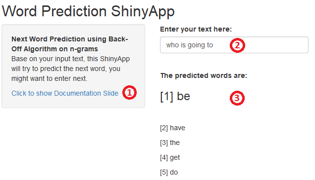

Word Prediction ShinyApp
========================================================
author: KEE
date: 17 June 2017
autosize: true
**Coursera Data Science Capstone Project**

Objective
========================================================
 - A ShinyApp that **predicts the next word**, base on user input.  

 - The word predict is based on a frequency dictionary that derive from **HC Corpora**.

 - The prediction technique involves **Text Mining** and **Natural Language Processing**.

Instruction to use the shinyApp
========================================================

1. **Documentation**: Link to show user this documentation.
2. **User Input**: Text box to accept user input.
3. Upon user make changes on *User Input* text box, lastest prediction word will be display.

Technical Details
========================================================
 - Due to hardware limit, **HC Corpora** is cropped into multiple part, to process separately in a loop.

 - **Ngrams** are extracted using R-Library: tm (Text Mining) and NLP (Natural Language Processing). Extracted Ngrams are stored for ShinyApp word prediction direct access.

 - Not every Ngram combination are covered, **Back-Off Algorithm** is adopted to ensure the every input are answered.

Thank you
========================================================

To access the shinyApp, please visit:

https://abyzzkee.shinyapps.io/capstone/

To refer the source file and documents:

https://github.com/AbyzzKee/Capstone/
